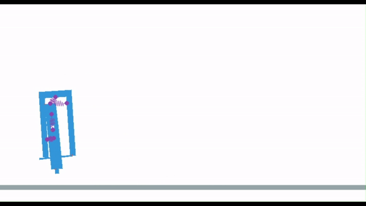
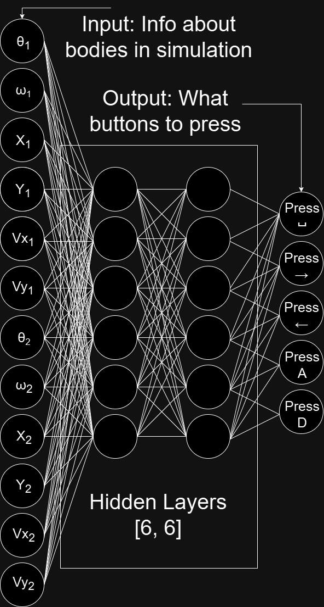
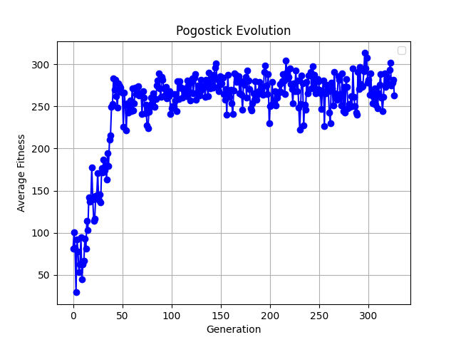

# Evolutionary Neural Net For Pogo Stick

## How to run
Clone this repository

    git clone https://github.com/jkarty3/evolutionary-pogo.git

Install dependencies

    pip install pygame
    pip install pymunk
    pip install matplotlib
    pip install numpy

Run `human_controlled.py` to control the agent yourself. Use left and right to control the top right spring, a and d to control the bottom left spring, and spacebar to jump.

Run `main.py` to begin training. Edit [parameters](#Parameters) from line 17 to 23 to modify the training, and press the x in the GUI to end the training and show results.

Run `checkpoint.py` to see the fully trained agent in action, or copy and paste the weights and biases from your agent into lines 40-57 to fine tune your agent.

## The physics engine
[Pymunk](https://github.com/viblo/pymunk) is used for the physics simulation. The pogo stick simulation is made up of multiple bodies connected together by springs. The top body represents the person, and the bottom two represent the pogostick. The top 2 springs represent the hands of the person, the bottom two springs represent the feet and jumping. The user/agent can control the bottom three springs.

## The neural network

The neural network takes inputs of the position, velocity, angle, and angular velocities of the body that represents the person and the body that represents the pogo. The neural network then calculates forward resulting in 5 outputs that control the movement of the pogostick. Note that in this image the hidden layers are `[6, 6]`, but when training I used hidden layers of `[20, 20, 20, 20, 20, 20]`

A child is created out of 2 neural networks by randomly selecting the weights and biases from each parent. For example, if parent 1 has biases `[0.1, 0.2, 0.3, 0.4, 0.5]` and parent 2 has biases `[0.6, 0.7, 0.8, 0.9, 1.0]`, the resulting child may have biases `[0.1, 0.7, 0.8, 0.4, 0.5]`.

The resulting child is then randomly mutated with a mutation rate. Each weight and bias has a random chance of mutation. If the mutation rate is 0.1, each weight and bias has a 10% chance of mutating by adding a random value between -0.1 and 0.1. A mutation rate of 0.01 means that each weight and bias has a 1% chance of mutating by adding a random value between -0.01 and 0.01.

## Parameters
`population_size`: This is the size of each generation. The larger the value, the more the space gets explored, but the longer it takes.

`mutation_rate`: This value represents the rate at which a child is mutated, and how large the mutations are. See [neural network](#the-neural-network) for more information.

`elitism`: If true, the top 20% of the population is kept into the next generation. This helps the system converge faster, but doesn't allow for full exploration of the space.

`annealing`: If true, the mutation rate is lowered after each generation. This allows the system to search the space a lot at the beginning, then slowly cool off the search and converge.

`annealing_step_size`: If annealing is true, this is the amount that is subtracted from the mutation rate after each generation.

`annealing_min`: If annealing is true, this is the minimum value that the mutation rate will reach.

`hidden_layers`: These are the hidden layers of the neural network. Each value in the list represents the number of nodes in that layer. See the [neural network](#the-neural-network) for more information.

## Training loop
#### The current generation
Agents are randomly generated until there are a `population_size` number of agents. An agent controls the pogo for 10 seconds, or until it falls over. The fitness of the agent is determined by the distance the pogo travels in pixels plus the time the pogo stayed alive times 10. This is weighted so that a pogo that sits still has about the same fitnes as a pogo that falls forward. If this weighting was not balanced, then the system would either converge to a solution of doing nothing or falling over forward. After a single agent is evaluated, the simulation is reset for the next agent.

#### The next generation
The top 20% of agents are selected for reproduction. If `elitism` is true, these agents are also kept for the next generation. The number of times an agent reproduces is determined by the function `generate_weighted_reproduction_matrix` in `NeuralNet.py`. The better an agent places, the more times it reproduces.

#### Training
These steps are then repeated. The average fitness of the agents is kept track of for plotting at the end, as shown below.

## Results

The system converges to a solution in around 2 hours after about 50 generations. The best agents, like the GIF at the beginning, reach distances of 500+ pixels. However, as I will discuss in [limitations](#limitations), they are not repeatable, so it is hard to improve them, even with elitism.

Overall, this methodology is successful, as the trained agents are much better at controlling the pogo than me, and they are able to reach much farther than me. However, reinforcement learning would be more apt for this problem. It would likely find a better solution and do it in a shorter period of time.

## Limitations
- Non-deterministic physics engine
    - I do not know how, but the simulation and agent are not deterministic. An agent with the same weights and biases may run twice in a row and not result in the same fitness value. This is troublesome because it interferes with the elitism, as a good agent may have a bad attempt and be cut from the population. This does help with exploring the space, but it makes it hard for this method to find a consistent solution.
- Training time
    - Ideally, the simulation would contain multiple agents that all run at the same time so that training time is decreased. This is future work.
- Evolutionary learning
    - Evolutionary learning is not ideal to solve this problem, as deciding between jumping forward and staying vertical is very hard to implement with just the fitness score. Instead, reinforcement learning should be used as the reward and value naturally align with staying upright and moving forward.
